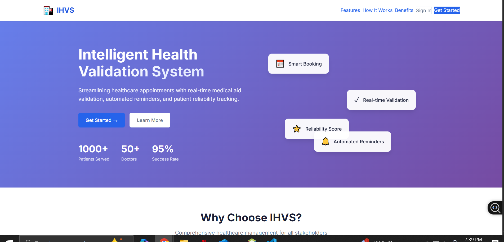
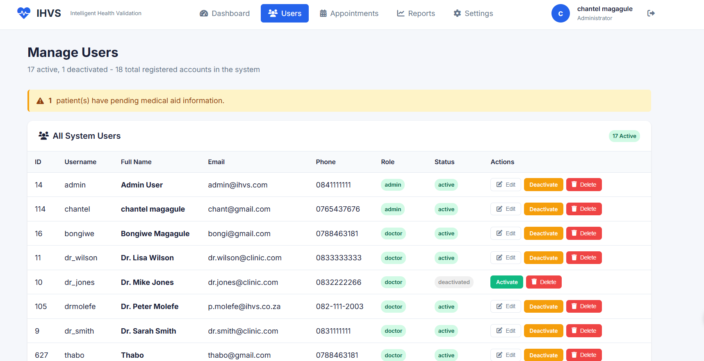
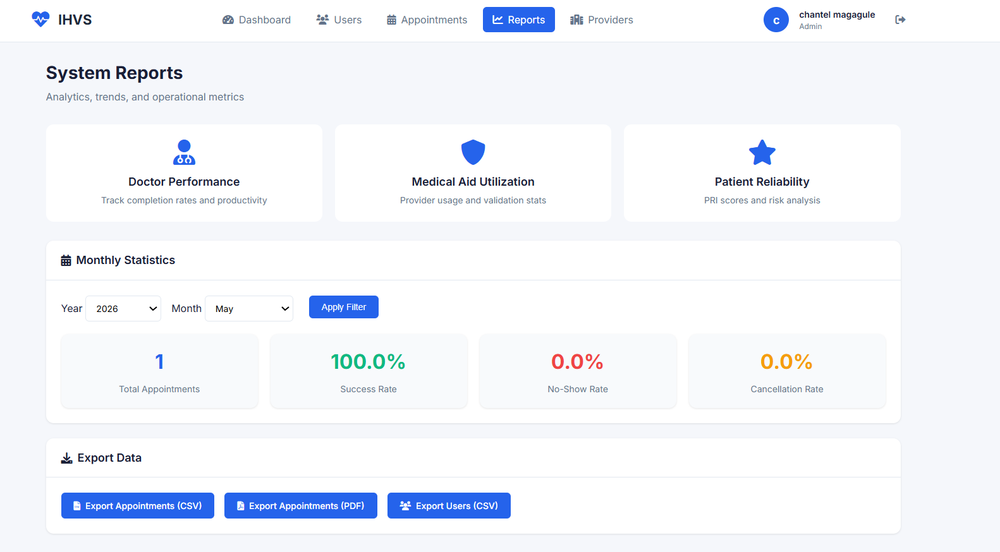
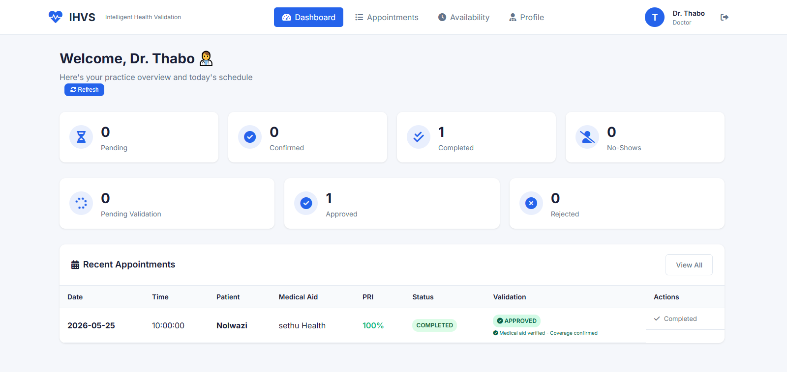
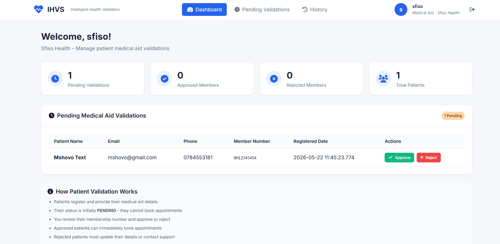
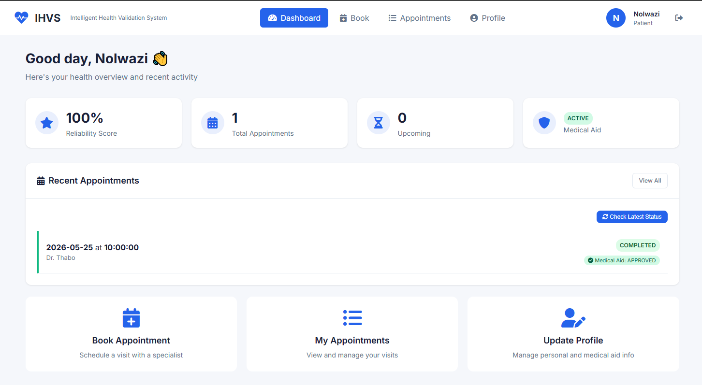

# 🏥 IHVS — Intelligent Health Validation System

> A web-based healthcare appointment and medical aid management platform built with Java EE, JSP, and Apache Derby.



---

## ✨ What It Does

IHVS is a multi-role health system that connects **patients**, **doctors**, **medical aid providers**, and **admins** in one place. It handles everything from booking appointments to validating medical aid claims — with automated email reminders to keep everyone in the loop.

---

## 👥 User Roles

| Role | What They Can Do |
|---|---|
| 🧑‍⚕️ **Patient** | Book appointments, view history, manage profile |
| 🩺 **Doctor** | Manage schedule & availability, handle appointments |
| 🏢 **Medical Aid** | Validate claims, view utilization history |
| 🔧 **Admin** | Manage all users, view reports, export PDFs, send reminders |

---

## 🖼️ Screenshots

### 🔧 Admin — Manage Users
> Admins can view, edit, activate/deactivate, or permanently delete any system user across all roles.



---

### 📊 Admin — System Reports
> Track doctor performance, medical aid utilization, and patient reliability. Export data as CSV or PDF.



---

### 🩺 Doctor Dashboard
> Doctors see a live overview of their appointments — pending, confirmed, completed, no-shows, and medical aid validation statuses.



---

### 🏢 Medical Aid Dashboard
> Medical aid providers review pending member validations and approve or reject patient coverage.



---

### 🧑‍⚕️ Patient Dashboard
> Patients see their reliability score, upcoming appointments, and medical aid status at a glance.



---

## 🛠️ Tech Stack

- **Backend:** Java EE (Servlets, Filters, Listeners)
- **Frontend:** JSP, HTML/CSS, JavaScript
- **Database:** Apache Derby (with custom connection pool)
- **PDF Export:** iTextPDF
- **Email:** JavaMail (`EmailService`)
- **Server:** GlassFish / any Java EE-compatible container
- **Build Tool:** Apache Ant (NetBeans project)

---

## 📁 Project Structure

```
IHVS_INTELLIGENT/
├── src/java/
│   ├── controller/     # Servlets (Admin, Doctor, Patient, MedicalAid, etc.)
│   ├── dao/            # Data Access Objects
│   ├── model/          # POJOs (User, Patient, Doctor, Appointment…)
│   ├── service/        # EmailService
│   ├── filter/         # Auth & encoding filters
│   ├── listener/       # App context & reminder scheduler
│   └── util/           # DBConnection pool, StoredProcedures, PasswordUtil
├── web/
│   ├── admin/          # Admin JSP pages
│   ├── doctor/         # Doctor JSP pages
│   ├── patient/        # Patient JSP pages
│   ├── medicalaid/     # Medical Aid JSP pages
│   ├── css/style.css
│   └── WEB-INF/web.xml
├── build.xml           # Ant build config
└── dist/               # Compiled .war file
```

---

## 🚀 Getting Started

### Prerequisites

- Java JDK 8+
- Apache Derby database
- GlassFish Server (or compatible Java EE server)
- NetBeans IDE *(recommended)* or any IDE with Ant support

### Setup

1. **Clone the repo**
   ```bash
   git clone https://github.com/your-username/IHVS_INTELLIGENT.git
   ```

2. **Set up the Derby database**
   - Start your Derby server on port `1527`
   - Create a database named `IHVS2` with user `app` / password `123`
   - Run the SQL schema scripts to create the required tables

3. **Configure (optional)**  
   Override DB credentials via system properties:
   ```
   -Dihvs.db.url=jdbc:derby://localhost:1527/IHVS2
   -Dihvs.db.user=app
   -Dihvs.db.password=yourpassword
   ```

4. **Build & deploy**
   ```bash
   ant build
   # Deploy dist/IHVS_INTELLIGENT.war to your GlassFish server
   ```

5. **Open in browser**
   ```
   http://localhost:8080/IHVS_INTELLIGENT/
   ```

---

## ⚙️ Key Features

- 🔐 **Role-based authentication** with session management and auth filters
- 📅 **Appointment booking** with real-time doctor availability checks
- 💊 **Medical aid validation** — providers approve/reject patient coverage
- ⭐ **Patient Reliability Index (PRI)** — tracks attendance and no-show history
- 📊 **Admin reports** — doctor performance, patient reliability, medical aid utilization
- 📄 **PDF & CSV export** of reports and appointment data
- ⏰ **Automated email reminders** via a background scheduler
- 🧾 **Audit logging** for all critical admin actions
- 🔒 **Password hashing** via `PasswordUtil`

---

## 📂 GitHub Images Setup

To display the screenshots above, create an `images/` folder in the root of your repo and upload these files into it:


images/
├── homepage.PNG
├── admin1.PNG
├── adminreports.PNG
├── doctor.PNG
├── medAid.PNG
└── patient.PNG


---

> Built with ☕ Java and a lot of care for healthcare workflows.
